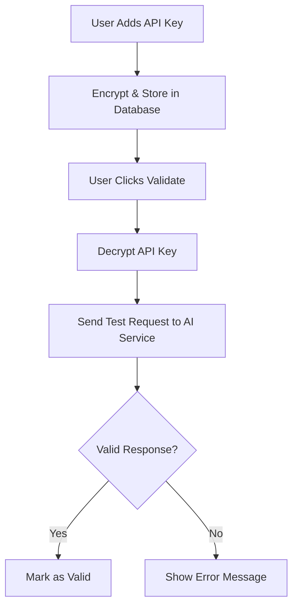

# 🤖 AI Hub - Chatbot Integration & API Key Guide

## 📋 Table of Contents
1. [How to Add Chatbots to Sessions](#how-to-add-chatbots-to-sessions)
2. [API Key Validation Process](#api-key-validation-process)
3. [Step-by-Step Setup Guide](#step-by-step-setup-guide)
4. [Troubleshooting](#troubleshooting)

---

## 🚀 How to Add Chatbots to Sessions

### **Step 1: Add API Keys**
1. **Sign in** to AI Hub
2. Click **"Settings"** in the top navigation
3. **Add API Keys** for the AI services you want to use:
   - **ChatGPT (OpenAI)**
   - **Gemini (Google)**
   - **Claude (Anthropic)**
   - **DeepSeek**

### **Step 2: Create Chat Sessions**
1. **Single AI Session:**
   - Enter an optional session title
   - Click **"+ ChatGPT"**, **"+ Gemini"**, **"+ Claude"**, or **"+ DeepSeek"**
   - A new chat window will open for that specific AI

2. **Multi-AI Session:**
   - Enter an optional session title
   - Click **"+ Multi-AI Session"**
   - This creates a session that can interact with multiple AIs simultaneously

### **Step 3: Start Chatting**
1. **Type your message** in the chat input
2. **Press Enter** or click the send button
3. **AI responds** based on the session type:
   - **Single AI:** Only that AI responds
   - **Multi-AI:** All configured AIs respond simultaneously

---

## 🔐 API Key Validation Process

### **How API Key Validation Works:**

#### **1. Storage & Encryption**
```csharp
// Backend: API keys are encrypted before storage
public class EncryptionService
{
    public string EncryptApiKey(string apiKey)
    {
        // Uses AES encryption with user-specific key
        return encryptedKey;
    }
}
```

#### **2. Validation Flow**


#### **3. Backend Validation Logic**
```csharp
// AIHub.API/Services/ChatGPTService.cs
public async Task<bool> ValidateApiKey(string apiKey)
{
    try
    {
        var client = new HttpClient();
        client.DefaultRequestHeaders.Authorization = 
            new AuthenticationHeaderValue("Bearer", apiKey);
        
        var response = await client.PostAsync(
            "https://api.openai.com/v1/chat/completions",
            new StringContent(JsonConvert.SerializeObject(new
            {
                model = "gpt-3.5-turbo",
                messages = new[] { new { role = "user", content = "Hello" } },
                max_tokens = 5
            }), Encoding.UTF8, "application/json"));
        
        return response.IsSuccessStatusCode;
    }
    catch
    {
        return false;
    }
}
```

#### **4. Frontend Validation**
```javascript
// Frontend: API key validation
const handleValidateApiKey = async (serviceName) => {
    try {
        setValidating(prev => ({ ...prev, [serviceName]: true }));
        const response = await apiKeyAPI.validateApiKey(serviceName);
        
        if (response.data.isValid) {
            setError('');
            // Show success message
        } else {
            setError(`${serviceName} API key is invalid`);
        }
    } catch (error) {
        setError('Failed to validate API key');
    } finally {
        setValidating(prev => ({ ...prev, [serviceName]: false }));
    }
};
```

---

## 📝 Step-by-Step Setup Guide

### **1. Get API Keys**

#### **ChatGPT (OpenAI)**
1. Visit: https://platform.openai.com/api-keys
2. Sign in to your OpenAI account
3. Click **"Create new secret key"**
4. Give it a name (e.g., "AI Hub")
5. Copy the generated key
6. **Paste in AI Hub Settings**

#### **Gemini (Google)**
1. Visit: https://makersuite.google.com/app/apikey
2. Sign in to your Google account
3. Click **"Create API Key"**
4. Copy the generated key
5. **Paste in AI Hub Settings**

#### **Claude (Anthropic)**
1. Visit: https://console.anthropic.com/
2. Sign in to your Anthropic account
3. Go to **"API Keys"** section
4. Click **"Create Key"**
5. Give it a name
6. Copy the generated key
7. **Paste in AI Hub Settings**

#### **DeepSeek**
1. Visit: https://platform.deepseek.com/
2. Sign in to your DeepSeek account
3. Go to **"API Keys"** section
4. Click **"Create API Key"**
5. Copy the generated key
6. **Paste in AI Hub Settings**

### **2. Add Keys to AI Hub**
1. **Open AI Hub** in your browser
2. **Sign in** to your account
3. Click **"Settings"** button
4. **For each service:**
   - Paste the API key in the input field
   - Click **"Save"**
   - Click **"Validate"** to test the key
   - You should see a **"Saved"** badge if successful

### **3. Create Chat Sessions**
1. **Single AI Chat:**
   - Enter session title (optional)
   - Click **"+ ChatGPT"** (or other AI)
   - Start chatting immediately

2. **Multi-AI Chat:**
   - Enter session title (optional)
   - Click **"+ Multi-AI Session"**
   - Send messages to all AIs at once

---

## 🔧 Troubleshooting

### **Common Issues:**

#### **1. API Key Validation Fails**
- **Check:** API key is correct and copied completely
- **Check:** You have sufficient credits/quota
- **Check:** API key has proper permissions
- **Try:** Generate a new API key

#### **2. Chat Not Working**
- **Check:** API keys are saved and validated
- **Check:** Internet connection is stable
- **Check:** Backend is running on port 3000
- **Try:** Refresh the page

#### **3. Backend Connection Issues**
- **Check:** Backend is running: `dotnet run` in AIHub.API folder
- **Check:** Port 3000 is not blocked
- **Check:** Database is created and migrated
- **Try:** Restart the backend

#### **4. Frontend Not Loading**
- **Check:** Frontend is running: `npm run dev` in Frontend folder
- **Check:** Port 5173 is not blocked
- **Check:** All dependencies are installed: `npm install`
- **Try:** Clear browser cache

### **Error Messages:**

| Error | Solution |
|-------|----------|
| "API key is invalid" | Check key format and permissions |
| "Failed to save API key" | Check backend connection |
| "No active sessions" | Create a new chat session |
| "Backend connection failed" | Start backend server |
| "Frontend not loading" | Start frontend server |

---

## 🎯 Quick Start Commands

### **Start the Application:**
```bash
# Option 1: Use the startup script
powershell -ExecutionPolicy Bypass -File start-aihub.ps1

# Option 2: Manual start
# Terminal 1 (Backend):
cd AIHub.API
dotnet run

# Terminal 2 (Frontend):
cd Frontend
npm run dev
```

### **Access Points:**
- **Frontend:** http://localhost:5173
- **Backend API:** http://localhost:3000
- **Swagger Docs:** http://localhost:3000/swagger

---

## 🔒 Security Features

### **API Key Protection:**
- ✅ **Encrypted Storage:** All API keys are encrypted before database storage
- ✅ **User Isolation:** Each user can only access their own API keys
- ✅ **Secure Transmission:** HTTPS for all API communications
- ✅ **No Logging:** API keys are never logged in plain text

### **Data Privacy:**
- ✅ **Local Storage:** Chat messages stored in your local database
- ✅ **No Third-Party Sharing:** Your data stays with you
- ✅ **User Control:** Delete sessions and API keys anytime

---

## 📞 Support

If you need help:
1. **Check this guide** for common solutions
2. **Visit the Support section** in AI Hub
3. **Check the FAQ** for detailed answers
4. **Verify your setup** matches the requirements

**Happy Chatting! 🤖✨**
